# JOSM Kurzdokumentation

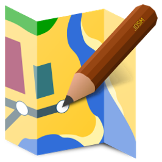

#### Zweck dieses Dokuments

*Dieses Dokument beschreibt JOSM. JOSM steht für Java OpenStreetMap Editor. Dieser Editor wird für die Mutationen von Daten in OpenStreetMap (OSM) verwendet. Ebenso wird anhand von Beispielen die einfache Anwendung beschrieben. Die Seiten wurden so unterteilt, dass das Anwendungsbeispiel separat ausgedruckt und verwendet werden kann.*

### LIZENZ

*Dieses Material steht unter der Creative-Commons-Lizenz Namensnennung 3.0 Switzerland. Um eine Kopie dieser Lizenz zu sehen, besuchen Sie <https://creativecommons.org/licenses/by/3.0/>*

## Software

### Installation

#### Link zur Installation

Du findest die Software JOSM unter folgendem Link: <https://josm.openstreetmap.de/>

### Windows 10

Aus Kompatibilitätsgründen empfehle ich dir diese Version zu installieren: 
*Vorsicht, unter Windows 10 gibt es einige Sicherheitswarnungen beim Installieren der Software.*

#### Installationsschritte

1. Sprache wählen
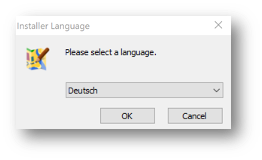
2. Installations-Wizard durchführen

3. Vollinstallation auswählen
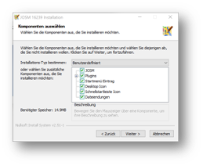

##### Java wird benötigt

Solltest du noch kein Java installiert haben, musst du dies für die Nutzung von JOSM noch installieren. Der Installationswizard führt dich direkt auf die Downloadseite von Java. Sollte dies nicht so sein, folge diesem Link: <https://www.java.com/de/download/>

### MacOS

Aus Kompatibilitätsgründen empfehle ich dir, diese Version zu installieren
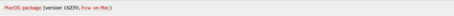

#### Installationsschritte

Öffne das heruntergeladene ZIP und zieh die JOSM Datei einfach in den Programme Ordner rein. Beim ersten Öffnen erscheint eine Warnung da das Paket aus einer nicht verifizierten Quelle stammt. Du kannst JOSM trotzdem Öffnen.
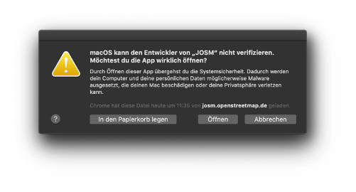
Die Installation ist nun fertig und JOSM kann verwendet werden. Grundsätzlich sind die Funktionen gegenüber der Windows Version 1:1 dieselben, das Aussehen ähnelt aber mehr dem von MacOS.

##### Java wird benötigt

Solltest du noch kein Java installiert haben, musst du dies für die Nutzung von JOSM noch installieren. Der Installationswizard führt dich direkt auf die Downloadseite von Java. Sollte dies nicht so sein, folge diesem Link: <https://www.java.com/de/download/>

## JOSM anwenden

*Ungeachtet dass oben beide Versionen zur Installation angeleitet wurden, beziehen sich weitere Screenshots immer auf die Windows Version von JOSM*

## JOSM das erste Mal starten

### Aktualisierung der Erweiterungen

Beim ersten Start wirst Du aufgefordert, die Erweiterungen, die vorinstalliert waren, zu aktualisieren. Das solltest Du auf jeden Fall machen.
Diese Meldung kommt von Zeit zu Zeit auch beim Starten von JOSM wenn es Aktualisierungen zu Erweiterungen gibt.

### Startbildschirm

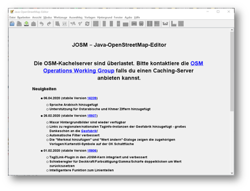
Das JOSM Projekt behält sich vor, euch immer die neusten Informationen direkt auf den Startbildschirm zu projizieren. Zusätzlich kriegst du immer die Change Logs angezeigt, der letzten Versionen.
Ebenfalls auf diesem Bildschirm wird angezeigt, sobald es eine neue Version gibt.

## JOSM einrichten

### Benutzerdaten

Am Anfang von JOSM würde ich dir gleich empfehlen, deine Benutzerdaten zu hinterlegen. Dazu kannst du einfach unter **Bearbeiten->Einstellungen** unter folgendem Symbol:  

Trage in das folgende OAUTH Feld deinen OSM Benutzernamen und dein Passwort ein.
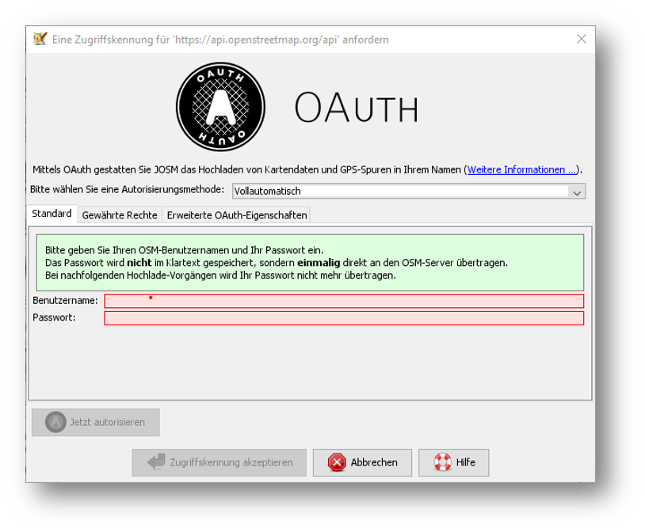

Klicke danach auf die Schaltfläche **Jetzt autorisieren** und du erhältst danach verschlüsselt die Zugriffskennung und einen geheimen Teil dieser Zugriffskennung. Wenn du magst, kannst du die Zugriffskennung testen, musst du aber nicht. Danach wirst du eine Bestätigung erhalten, dass deine Daten auf dem offiziellen OSM Server akzeptiert wurden.

### Hintergründe

JOSM bietet eine Vielzahl an Hintergrundkarten bereits ab Grundinstallation an. JOSM lässt sich soweit individualisieren, dass man WMS/TMS Dienste anbinden kann wie z.B geolion.ch. Wem also die Standardauswahl für die Schweiz nicht reicht, oder dann einen speziellen Hintergrund braucht, der kann ganz einfach einen WMS Dienst anbinden.

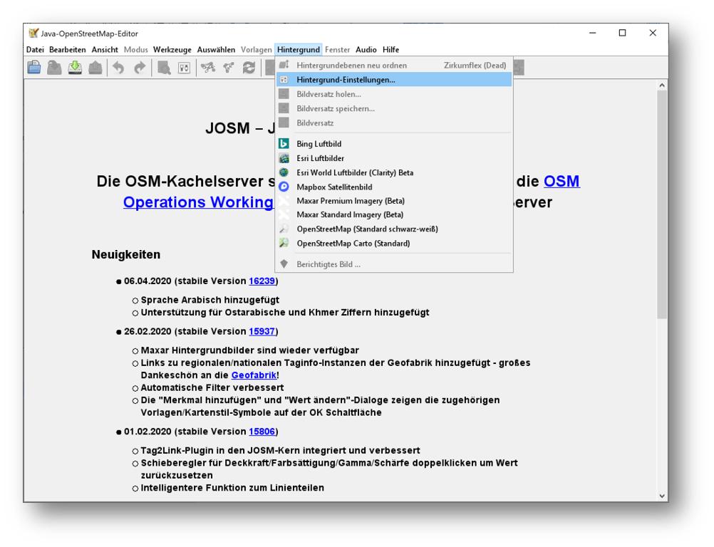

#### Hintergrund wählen

Um einen Hintergrund zu wählen wählst du im oben gezeigten Screenshot “Hintergrund-Einstellungen”. Danach kannst du dir deine Hintergrundkarten selbst zusammenstellen.

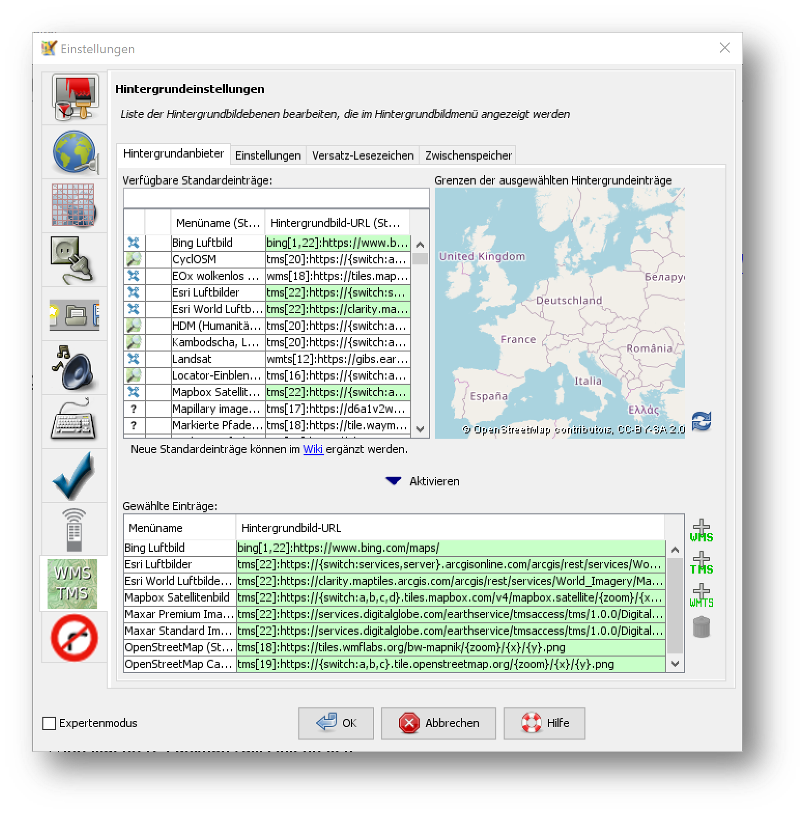

*VERGISS NICHT, DIE AUSWAHL DIE DU GETROFFEN HAST ZU AKTIVIEREN!*

#### Kurzwahl definieren

Um nicht jedes Mal die Hintergrundleiste aufmachen zu müssen, kann man eine Kurzwahl über die Symbolleiste anlegen. Dazu musst du nur einen Rechtsklick auf die Symbolleiste machen und dann “Symbolleiste” konfigurieren anwählen. Danach kannst du im folgenden Menü alle Kürzel wählen.

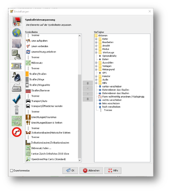

Wenn ihr dies in der Kurzwahl eingefügt hab, erscheint die Kartenansicht in eurer Symbolleiste am oberen Rand und du kannst diese beim Start einfach aktivieren.

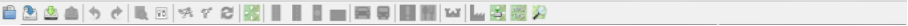

### Erweiterungen

Zur Einrichtung von JOSM gehören auch Erweiterungen. Die Vielfältigkeit die Erweiterungen bieten, möchte ich gerne im [Erweiterungen](#Erweiterungen) erläutern.

## JOSM benutzen

### Daten herunterladen
Um Daten herunterzuladen musst du folgendes Symbol verwenden:  
Du findest dieses Symbol in der Symbolleiste auf der linken Seite. Nach dem Drücken des Knopfes erscheint eine Minikarte. Auf dieser Karte kannst du auf den Ort zoomen, den du mappen willst. Beschränke dich beim Datendownload auf ein kleines Gebiet. Wählst du ein zu grosses Gebiet, wirst du vom Server vermutlich einen Fehler erhalten. Solltest du ein ganzes Dorf mappen wollen, kannst du den Datenradius in mehreren Malen herunterladen. Du wiederholst dafür einfach soeben genannte Schritte und nimmst einen anderen Radius.

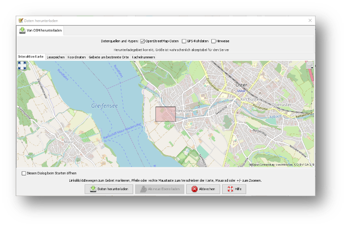

Sobald du die Daten heruntergeladen hast, siehst du folgenden Screen:

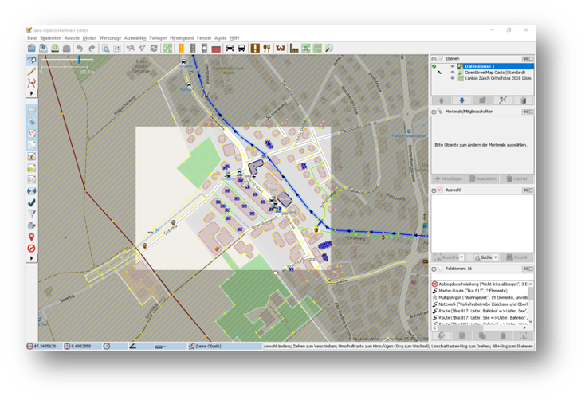

## Daten bearbeiten

In JOSM lässt sich alles pflegen was man mit dem bekannten Browser Editor iD auch machen kann. Jede Funktion zu erklären würde den Zweck dieses Dokumentes bei weitem sprengen. Deswegen erkläre ich hier die grundlegenden Funktionen die auch iD beherrscht.

### Punkt setzen

Um einen Punkt auf der Karte zu setzen, kannst du mit **Tastaturkürzel A** drücken und du kommst in den Zeichnungsmodus. Setze nun mit der Maus den Punkt, den du möchtest.

### Fläche zeichnen

Um eine Fläche zu zeichnen kannst du wieder mit **Tastaturkürzel A** in den Zeichnungsmodus wechseln. Anstatt nur einen Punkt zu setzen kannst du nun die Fläche mit verschiedenen Punkten zeichnen. Sobald du fertig bist, kannst du mit **Tastaturkürzel S** den Zeichnungsmodus beenden.

### Vorlagen verwenden

Eine sehr nützliche Funktion in JOSM sind die Vorlagen. Vorlagen lassen sich auf Punkte und Flächen anwenden. Wenn du etwas Bestimmtes mappen willst kannst du mit **F3** die Vorlagenfunktion aufrufen.

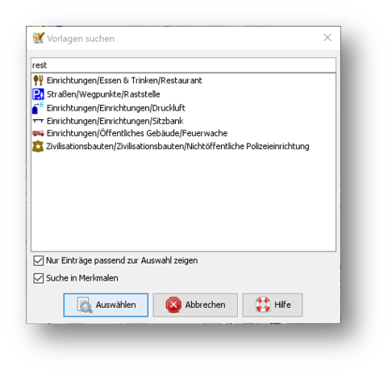

Es lässt sich beinahe alles Suchen, dass sich mit Tags versehen lässt. Vorteil dabei ist, dass die benötigten Felder eines korrekten Taggings bereits vorgeschlagen werden und du nur noch die Daten ausfüllen musst. Solltest du etwas nicht wissen, lasse das Feld leer. Dann kann jemand anderes diese Daten ergänzen. Das ist der Vorteil der Community.

Hier ein Anwendungsbeispiel für einen Adresspunkt:

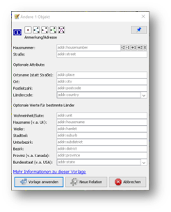

### Tags kopieren / einfügen

Eine weitere Funktion, die nur in JOSM so gut funktioniert ist, die Funktion einen oder mehrere Tags zu kopieren. Das eignet sich besonders gut um mehrere, ähnliche Tags zu bearbeiten. Gerne erkläre ich dir dies, anhand einer Strasse, bei der wir nur die Hausnummern editieren wollen.
Am besten legst du dir am Anfang ein Objekt zurecht das dir als Grunddatensatz dienen wird. Danach solltest du dies normal mit allen Tags versehen die du für weitere Objekte auch benötigen wirst. Nun kannst du alle diese Tags markieren und dann mit **Ctrl + C** alle Tags kopieren.

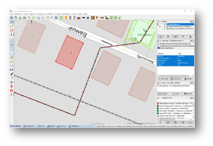

Du hast nun alle Tags markiert und kannst dann alle Tags auf dem neuen leeren Objekt einfügen. Danach musst du nur noch die Hausnummer die unterschiedlich ist, einzeln anpassen.

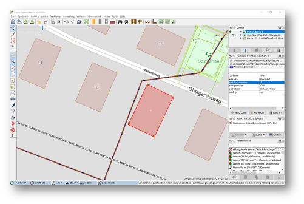

### Daten hochladen

Wenn du mit deinem Datensatz fertig bist, musst du diesen auf OSM hochladen. Dabei benutzt du folgendes Symbol: 

Dies machen wir nun mit unseren Änderungen aus dem vorherigen Kapitel.
Sobald ich die Funktion aufgerufen habe, öffnet sich der Dialog um das Changeset zu kommentieren.

Fülle diese Kommentare immer mit sinnvollen und nachvollziehbaren Änderungskommentaren aus, so dass dies, wenn jemand dein Change Set liest, deine Änderungen gleich erkennen kann.

## Erweiteruungen

### Erweiterungen installieren

Erweiterungen bringen den Funktionsumfang von JOSM noch weiter und es gibt für fast jede Situation eine passende Erweiterung. Du kannst Erweiterungen unter Bearbeiten -> Einstellungen unter diesem Symbol finden: 

Du kriegst nun eine Auflistung aller Erweiterungen, ob installiert oder einfach verfügbar. Du kannst hier nach jeder verfügbaren Erweiterung suchen.

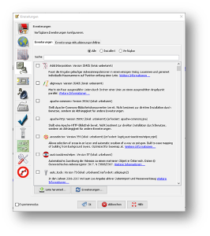

Du musst die gewünschte Erweiterung oder die Erweiterungen anwählen und danach OK drücken. Dies installiert das ausgewählte Plugin dann automatisch. Gewisse Plugins erfordern einen Neustart von JOSM

### Empfehlungen

Zum Start empfehle ich dir folgende Erweiterungen, die dich am Anfang am Weitesten bringen werden:

* Building_tools: Erleichtert das Zeichnen von Gebäuden oder deren logischen Unterteilung.
* HouseNumberTaggingTool: Ein Wizard der dir alle Tags für das korrekte Erstellen von Hausnummern vorschlägt, die du nur noch abfüllen musst.
* Imagery_offset_db (vorinstalliert): Ein Tool, um Bildversätze zu importieren.
* OpeningHoursEditor: Ein Wizard der dir hilft die Öffnungszeiten von Geschäften, Bars, Restaurants usw. korrekt zu taggen.
* Terracer: Genial, um Reihenhäuser aus einem quadratischen Block zu erstellen und gleichzeitig das Tagging für alle neuen Einheiten die Tags zu versehen.
* Utilsplugin2: Diverse kleine Helfer die dir das Leben vereinfachen.

## Best Practices

Der Einstieg ist nicht schwer, aber übernimm dich am Anfang nicht gleich, beginne mit einem Gebiet, dass du kennst und mach vorerst mal nur kleine Änderungen. Wenn du bereits länger mit dem iD mappst, sieh dir die Datensätze die du bereits gemappt hast mal in JOSM an. Mache kleine Änderungen an deinen eigenen Change Sets und steigere dich in immer grössere Gebiete. Wage auch mal etwas, dass du noch nie gemappt hast. Verliere nicht die Freude und hab Spass.
Hier noch mein persönlicher Tipp; Scheue dich nicht mal etwas Unbekanntes zu mappen. Schaue dir die Hilfsmittel an und mappe es nach bestem Wissen und Gewissen. Falls dies der Community nicht passt wird Sie dir das schon mitteilen. Diskutiere nicht und zeige dich einsichtig oder hole jemanden zu Rate.

## Weiterführende Informationen und Quellen

* Openstreetmap im Web
<https://www.openstreetmap.org/>

* Offizielle JOSM Bedienungsanleitung
<https://josm.openstreetmap.de/wiki/Introduction>

* Mapbox JOSM Blog Artikel
<https://blog.mapbox.com/your-first-steps-with-josm-the-java-openstreetmap-editor-9e2fcafa7ba8>

* Openstreetmap Wiki
Das offizielle Nachschlagewerk für Tags usw.:
<https://wiki.openstreetmap.org/wiki/DE:Hauptseite?uselang=de>

* “How to map a..” Seite
Sehr nützlich um verschiedene Szenarien/Taggings nachzuschlagen.
<https://wiki.openstreetmap.org/wiki/DE:How_to_map_a>

* Changeset
<https://wiki.openstreetmap.org/wiki/Changeset>

* Swiss Openstreetmap Association
<https://sosm.ch/de/>
